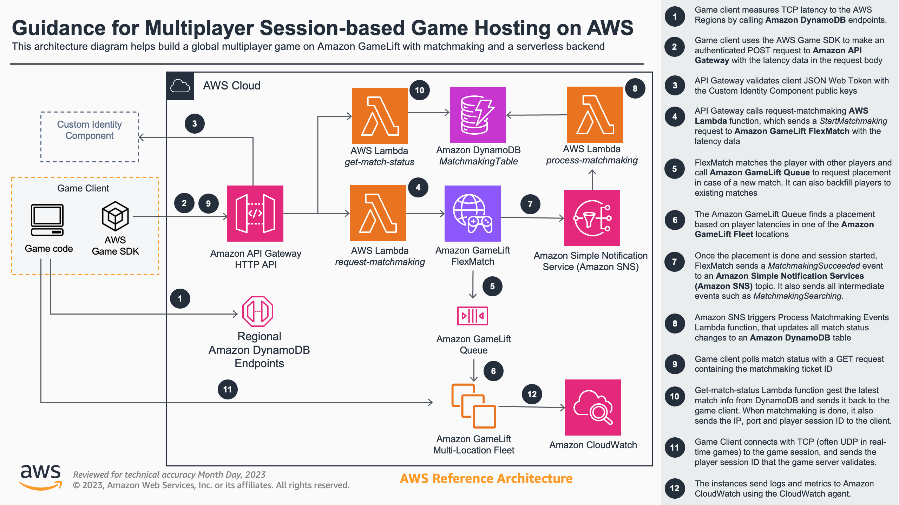

# AWS Game Backend Framework Features: Amazon GameLift Integration

- [AWS Game Backend Framework Features: Amazon GameLift Integration](#aws-game-backend-framework-features-amazon-gamelift-integration)
- [Preliminary setup](#preliminary-setup)
- [Deploying the Amazon GameLift integration feature](#deploying-the-amazon-gamelift-integration-feature)
- [Architecture](#architecture)
- [Integration with the Game Engines](#integration-with-the-game-engines)
   * [Unreal Engine integration](#unreal-engine-integration)
   * [Unity integration](#unity-integration)
   * [Godot integration](#godot-integration)
- [Solution overview](#solution-overview)
   * [Sample Game Server](#sample-game-server)
   * [The Serverless Backend](#the-serverless-backend)
   * [Amazon GameLift resources](#amazon-gamelift-resources)
   * [Amazon CloudWatch logs and metrics](#amazon-cloudwatch-logs-and-metrics)
- [API Reference](#api-reference)
      + [POST /request-matchmaking](#post-request-matchmaking)
      + [GET /get-match-status](#get-get-match-status)
- [Unity and Unreal Game Server Builds with GameLift Plugins](#unity-and-unreal-game-server-builds-with-gamelift-plugins)
   * [Integrating with the Amazon GameLift Plugin for Unity Engine](#integrating-with-the-amazon-gamelift-plugin-for-unity-engine)

This backend feature integration shows how to deploy a backend service that interacts with Amazon GameLift, as well as all the required Amazon GameLift resources. The feature comes with a simple sample game server for testing, from which you can then extend to using the Unreal and Unity GameLift Plugins for running a headless version of your game on Amazon GameLift.

# Preliminary setup

This backend feature requires that you have [deployed the Identity component](../../CustomIdentityComponent/README.md). Once that is done, set the `const ISSUER_ENDPOINT` in `BackendFeatures/AmazonGameLiftIntegration/bin/amazon_gamelift_integration.ts` to the value of `IssuerEndpointUrl` found in the stack outputs of the _CustomIdentityComponentStack_. You can find it in the CloudFormation console, or in the terminal after deploying the identity component.

Make sure that you have Docker running before opening any terminals or Powershell as both the backend deployment as well as game server build process will use Docker. You're also expected to have all the tools listed in [Custom Identity Component Readme](../../CustomIdentityComponent/README.md#deploy-the-custom-identity-component) installed.

# Deploying the Amazon GameLift integration feature

To deploy the component, follow the _Preliminary Setup_, and then run the following commands (Note: on **Windows** make sure to run in Powershell as **Administrator**):

1. Navigate to `BackendFeatures/AmazonGameLiftIntegration/SimpleServer/` folder in your terminal or Powershell
2. You can now either build the game server in a container (takes between 10-30 minutes with all dependencies) or download the prebuilt binary which shouldn't take more than a few seconds.
  * Option 1: Run `./copy_prebuilt_game_server_binary.sh` to download the prebuilt binary and extract it to the `LinuxServerBuild` folder.
  * Option 2: Run `./buildserver.sh` to build the game server in a container (which is then copied to the `LinuxServerBuild` folder). This takes time as the Amazon GameLift C++ Server SDK is downloaded and built along with other dependencies before building the sample C++ server.
3. Navigate to `BackendFeatures/AmazonGameLiftIntegration` by running `cd ..`
4. Run `npm install` to install CDK app dependencies
6. Run `cdk deploy --all` to deploy both the backend APIs as well as the Amazon GameLift resources CDK apps to your account. You will need to accept the deployment. This will take around 45 minutes to fully deploy the game servers globally to all default locations (us-east-1, us-west-2, and eu-west-1)

# Architecture

The architecture diagram below shows the main steps of integration from the game engine to the backend and the game servers hosted on Amazon GameLift. See the main Readme of the project for details on how the Custom Identity Component is implemented.



# Integration with the Game Engines

## Unreal Engine integration

To test the integrations with Unreal, **open** the Unreal sample project (`UnrealSample`) in Unreal Engine 5 first.

**NOTE:** On Windows it will prompt you if you don't have Visual Studio installed yet. Once you have Visual Studio installed and set up for Unreal, you can open the project in the Unreal Editor and generate the project files from *Tools -> Generate Visual Studio Project*. On MacOS, you need to do *right click -> Services -> Generate XCode Project* on the uproject file in Finder. If you have problems generating the project files on MacOS, [this forum post](https://forums.unrealengine.com/t/generate-xcode-project-doesnt-do-anything/123149/3) can help run the shell script correctly from your UE installation folder against the project in the terminal.

* Then **open** the level `BackendFeatures/AmazonGameLiftIntegration`

This is a test level that will measure latencies to 3 predefined locations (same as the default setup for the fleet). It will then login as a new guest user if a save file is not present, or login using the user_id and guest_secret found in the save file if available to login as an existing user. It will then use the logged to request matchmaking (sending the latency data that was measured in a separate thread), and start polling for the match status. Once the match is created successfully, it will start a thread with a simple TCP client to connect to the sample server, send the player session ID for validation, and receive the response.

Configure the `AmazonGameLiftIntegration` component of the `AmazonGameLiftIntegration` Actor to set up API endpoints. Set `M Login Endpoint` value to the `LoginEndpoint` value found in the CustomIdentityComponentStack Outputs. Then set the `M Gamelift Integration Backend Endpoint Url` to the endpoint `AmazonGameLiftIntegrationBackendEndpointUrl` value found in the *AmazonGameLiftIntegrationBackend* Outputs.

Press play to test the integration. You'll see the login, backend call activity, latency data, and game server connection in the Output Log as well as key items on on screen log as well. The client only sends the player session ID to the server and then quits after receiving the response to the validation.

## Unity integration

To test the integrations with Unity, **open** the Unity sample project (`UnitySample`) with Unity 2021 (or above).

* Then **open** the scene `BackendFeatures/AmazonGameLiftIntegration/AmazonGameLiftIntegration.unity`

This is a test level that will measure latencies to 3 predefined locations (same as the default setup for the fleet). It will then login as a new guest user if the login information is not yet in PlayerPrefs, or login using the user_id and guest_secret found in PlayerPrefs to login as an existing user. It will then use the logged to request matchmaking (sending the latency data that was measured), and start polling for the match status. Once the match is created successfully, it will start a simple TCP client to connect to the sample server, send the player session ID for validation, and receive the response.

Configure the `AmazonGameLiftIntegration` component of the `AmazonGameLiftIntegration` GameObject to set up API endpoints. Set `Login Endpoint Url` value to the `LoginEndpoint` value found in the CustomIdentityComponentStack Outputs, and the `GameLift Integration Backend Endpoint Url` to the `AmazonGameLiftIntegrationBackendEndpointUrl` value found in the *AmazonGameLiftIntegrationBackend* Outputs.

Press play to test the integration. You'll see the login, backend call activity, latency data, and game server connection in the Output Log as well as key items on on screen log as well. The client only sends the player session ID to the server and then quits after receiving the response to the validation.

## Godot integration

To test the integrations with Godot 4, **open** the Godot 4 sample project (`GodotSample`) with Godot 4.

* Then **open** the scene `BackendFeatures/AmazonGameLiftIntegration/AmazonGameLiftIntegration.tscn`

This is a test scene that will measure latencies to 3 predefined locations (same as the default setup for the fleet). It will then login as a new guest user if the login information is not yet in a save file, or login using the user_id and guest_secret found in the save file to login as an existing user. It will then use the logged to request matchmaking (sending the latency data that was measured), and start polling for the match status. Once the match is created successfully, it will start a simple TCP client to connect to the sample server, send the player session ID for validation, and receive the response.


Configure the `BackendFeatures/AmazonGameLiftIntegration/AmazonGameLiftIntegration.gd` script to set up API endpoints. Set `const login_endpoint` value to the `LoginEndpoint` value found in the CustomIdentityComponentStack Outputs, and the `const gamelift_integration_backend_endpoint` to the `AmazonGameLiftIntegrationBackendEndpointUrl` value found in the *AmazonGameLiftIntegrationBackend* Outputs.

Press play to test the integration. You'll see the latency data, login, backend call activity, and game server connection in the Output Console. The client only sends the player session ID to the server and then quits after receiving the response to the validation.

# Solution overview

## Sample Game Server

The sample game server code and build scripts can be found in `BackendFeatures/AmazonGameLiftIntegration/SimpleServer`. 

The sample game server is a C++ application, that integrates with the Amazon GameLift Server SDK 5. It sets up the game server based on server port passed on command line arguments (from the Amazon GameLift fleet configuration), and starts logging to the log file configured in the CloudWatch agent configuration to collect realtime logs to CloudWatch logs. It will then start waiting for Amazon GameLift to trigger the callback for game sessions started, after which it will start a 60 second timer to simulate the game session. During this time, it will accept TCP socket connections in a separate thread, in which it expects to receive the player session ID, which is validated with the GameLift Server SDK to make sure the correct users are connecting to the server. It's worth noting that the sample game server doesn't actually implement any simulation logic, which you would typically do yourself with a physics engine, or using a headless build from your game engine. It's also recommended to use UDP-based networking libraries (native to the game engines or other) for fast paced realtime games.

You will build the game server binary in a container environment with Docker, which will download and build all depencies and build the server itself. Optionally you can download the prebuilt binary to get started faster. The sample server can be useful if you're building a custom C++ game server (for a custom C++ engine for example). For the game engines including Unity and Unreal, you will likely want to run a headless version of the game on the server side. See the [Unity and Unreal Game Server Builds with GameLift Plugins](#unity-and-unreal-game-server-builds-with-gamelift-plugins) for details on how to leverage the Amazon GameLift plugins for this.

## The Serverless Backend

The serverless backend is hosted with an Amazon API Gateway HTTP API, which routes request to AWS Lambda functions. It authenticates the requests with an Authorizer that validatest JSON Web Tokens using the public key available through the endpoint you provided in `BackendFeatures/AmazonGameLiftIntegration/bin/amazon_gamelift_integration.ts`. See the [API Reference](#api-reference) for details on the API.

The backend is deployed as a AWS Cloud Development Kit (AWS CDK) application, which defines all the resources including:

* The API Gateway
* The backend Lambda functions for requesting matchmaking and requesting match status
* An Amazon DynamoDB table for storing the matchmaking tickets
* An Amazon Simple Notification Services (Amazon SNS) topic for routing Amazon GameLift FlexMatch matchmaking events
* The Lambda function that receives matchmaking events through SNS and stores the results in Amazon DynamoDB

The CDK stack definition can be found in `BackendFeatures/AmazonGameLiftIntegration/lib/amazon_gamelift_integration-backend.ts`, and the Lambda function Python code can be found in `BackendFeatures/AmazonGameLiftIntegration/lambda`.

All of the services are configured with **AWS X-Ray** for distributed tracing, and the Lambda functions use **Lambda Powertools for Python** to collect more detailed traces and data in integrations to other services.

## Amazon GameLift resources

The Amazon GameLift resources are deployed with the CDK stack defined in `BackendFeatures/AmazonGameLiftIntegration/lib/amazon_gamelift_integration-gamelift-resources.ts`. It will deploy all the required resources in Amazon GameLift including

* The FlexMatch matchmaking configuration and a simple FlexMatch rule set that matches players based on latency
* The Amazon GameLift Queue that receives placements requests from FlexMatch and finds a game session on the fleet
* The Amazon GameLift Build that is created from assets found in `LinuxServerBuild` folder
* The Amazon GameLift Fleet that is hosted across three locations by default (us-east-1, us-west-2, and eu-west-1) and is hosting your game server build

The stack will import the Amazon SNS Topic (created by the serverless backend stack) for the Matchmaking configuration to send matchmaking events to. These events are then processed by the Lambda function created in the first CDK stack.

The Amazon GameLift Fleet will be configured with two game servers running (that receive their port and log file as parameters). You should configure your own game to be hosted in any amount of processes on an EC2 instance (between 1-50) based on your selected instance type and the resource consumption of your game server.

## Amazon CloudWatch logs and metrics

The Amazon GameLift Fleet instances are configured to send both logs as well as process level metrics to Amazon CloudWatch. This is done with the CloudWatch Agent that is installed with the `install.sh` script found under `LinuxServerBuild` and configured to use the Fleet IAM role to access CloudWatch. The configuration files under `LinuxServerBuild` are `amazon-cloudwatch-agent.json` and `common-config.toml` that are copied to the appropriate location in the script and used with the agent.

You can view the realtime game server logs under the CloudWatch Log Group `GameServerLogs` in all the AWS Regions the game servers are hosted in. You'll find the process level metrics of the instances under `CWAgent` in the Metrics section in CloudWatch.

# API Reference

All API requests expect the `Authorization` header is set to the JWT value received when logging in. This is automatically done by the AWS Game SDK's for the different game engines when you call the POST and GET requests through their API's.

### POST /request-matchmaking

`POST /request-matchmaking`

**Parameters**

> | name      |  required | description                                                                    |
> |-----------|-----------|--------------------------------------------------------------------------------|
> | `body`   |  Yes       | The body of the POST request. Must be in JSON format with latencies to the different Regions. Example: `{ "latencyInMs": { "us-east-1" : 10, "us-west-2" : 20, "eu-west-1" : 30 }}`  |

**Responses**

> | http code     | response                                                            |
> |---------------|---------------------------------------------------------------------|
> | `200`         | `{"TicketId": "abc", "ConfigurationName": "SampleFlexMatchConfiguration", "ConfigurationArn": "arn:aws:gamelift:us-east-1:1234567890:matchmakingconfiguration/SampleFlexMatchConfiguration", "Status": "ABC", "StartTime": "abc", "Players": [{"PlayerId": "abc", "PlayerAttributes": {}, "LatencyInMs": {"eu-west-1": 10, "us-east-1": 20, "us-west-2": 30}}]}`                                |
> | `500`         |  `"Matchmaking request failed"`                            |

### GET /get-match-status

`GET /get-match-status`

**Parameters**

> | name      |  required | description                                                                    |
> |-----------|-----------|--------------------------------------------------------------------------------|
> | `ticketId`   |  Yes       | The ticket ID received when matchmaking started. |

**Responses**

> | http code     | response                                                            |
> |---------------|---------------------------------------------------------------------|
> | `200`         | `"MatchmakingStatus": "STATUS", "Port": "1234", "IpAddress": "11.111.111.111", "DnsName": "abcd.compute.amazonaws.com", "PlayerSessionId": "psess-12345"}`. **NOTE:** You will only receive the *MatchmakingStatus* unless the matchmaking has succeeded and the status is *MatchmakingSucceeded* in which case you'll receive all the fields.                                |
> | `400`         |  `"TicketId not found in DynamoDB table"`                            |
> | `500`         |  `"user_id not available in claims"`                            |
> | `500`         |  `"ticketId not available in querystrings"`                            |


# Unity and Unreal Game Server Builds with GameLift Plugins

## Integrating with the Amazon GameLift Plugin for Unity Engine

If you're developing with Unity, you commonly want to run a headless Linux version of your Unity game build on GameLift. The Amazon GameLift Plugin for Unity Engine helps you integrate with the Amazon GameLift Server SDK easily and it supports local testing with GameLift Anywhere.

To use the AWS Game Backend Framework Amazon GameLift integration together with the Amazon GameLift Plugin for Unity Engine, and test with the sample game, follow the steps below to learn how to set both tools up in a single project and what sections in the code you'll need to modify as well. **NOTE:** These steps are supported only on Unity 2022 and up!

1.	**Add** the *“Linux Dedicated Server”* support to your Unity installation, You’ll need to reopen your project after doing this.
2.	**Download** and **unzip** the [Amazon GameLift Plugin for Unity Engi](from https://github.com/aws/amazon-gamelift-plugin-unity/releases/tag/v2.0.0) to any folder of your choice.
3.	**Open** the `UnitySample` project within AWS Game Backend Framework. You can also create a copy of it first if you don’t want to modify the sample project directly.
4.	**Follow all the three steps**  of [setting up the plugin](https://github.com/aws/amazon-gamelift-plugin-unity?tab=readme-ov-file#install-the-plugin) within the UnitySample project, **including** importing the sample game.
5.	After the files are imported, go to the Amazon GameLift menu in Unity and **select** *Sample Game -> Initialize Settings*. This step configures your project for building the game client and server.
6.	**Follow** the [plugin docs](https://docs.aws.amazon.com/gamelift/latest/developerguide/unity-plug-in-profiles.html) to set up the AWS user configuration. **Select** us-east-1 for the Region. **NOTE:** We’re not really using this to deploy anything in our case, but need to set up the access to access the other features of the plugin.
7.	**OPTIONAL:** You can optionally test the integration with Amazon GameLift Anywhere by following the steps under *“Host with GameLift Anywhere”* the GameLift menu to make sure everything works with the sample server. This is not required but shows you how you can host a local game server that registers to an Amazon GameLift Anywhere fleet.
8.	**Make sure you only have the configuration files under LinuxServerBuild folder** (install.sh, amazon-cloudwatch-agent.json, and common-config.toml). **Build a server executable** using the standard Unity build process. **Select** *File -> Build Settings*, and switch the platform to Dedicated Server.
  * **Select** Linux as the target
  * **Select** build and select the folder `BackendFeatures/AmazonGameLiftIntegration/LinuxServerBuild`
  * Set the name to `GameLiftSampleServer`
9.	**Open** the file `BackendFeatures/AmazonGameLiftIntegration/bin/amazon_gamelift_integration.ts` and **set** `serverBinaryName: "GameLiftSampleServer.x86_64"` as this is the name of the binary created from Unity.
10.	Make sure you've followed the [Preliminary Setup](#preliminary-setup) for setting up the Identity Component, and then deploy the backend APIs and the Amazon GameLift resources with the following steps:
  * Navigate to `BackendFeatures/AmazonGameLiftIntegration/SimpleServer/` folder in your terminal or Powershell
  * Navigate to `BackendFeatures/AmazonGameLiftIntegration`
  * Run `npm install` to install CDK app dependencies
  * Run `cdk deploy --all` to deploy both the backend APIs as well as the Amazon GameLift resources CDK apps to your account. You will need to accept the deployment. This will take around 45 minutes to fully deploy the game servers globally to all default locations (us-east-1, us-west-2, and eu-west-1)
11. **Do all the following code changes in the Unity project** to build the integration from the AWS Game Backend Framework to the Unity plugin:

File `UnitySample/Assets/Scripts/GameLift.cs` in the `member variable definitions` at **around row 42**:

```csharp
...
    public bool IsConnected { get; set;}

    public static int port; // ADD THIS SO WE CAN SET IT FROM OUR BACKEND FRAMEWORK INTEGRATION
    public static string ipAddress; // ADD THIS SO WE CAN SET IT FROM OUR BACKEND FRAMEWORK INTEGRATION
    public static string playerSessionId; // ADD THIS SO WE CAN SET IT FROM OUR BACKEND FRAMEWORK INTEGRATION
...
```

In the same file in the `GetConnectionInfo` method at **around row 190**:

```csharp
...
    public async Task<(bool success, ConnectionInfo connection)> GetConnectionInfo(CancellationToken cancellationToken = default)
    {
        var connectionInfo = new ConnectionInfo(); // ADD THIS TO FORCE SET THE CONNECTION INFO TO THE VALUES FROM BACKEND FRAMEWORK
        connectionInfo.Port = GameLift.port; // ADD THIS TO FORCE SET THE CONNECTION INFO TO THE VALUES FROM BACKEND FRAMEWORK
        connectionInfo.IpAddress = GameLift.ipAddress; // ADD THIS TO FORCE SET THE CONNECTION INFO TO THE VALUES FROM BACKEND FRAMEWORK
        connectionInfo.PlayerSessionId = GameLift.playerSessionId; // ADD THIS TO FORCE SET THE CONNECTION INFO TO THE VALUES FROM BACKEND FRAMEWORK

        return (true, connectionInfo); // ADD THIS TO FORCE SET THE CONNECTION INFO TO THE VALUES FROM BACKEND FRAMEWORK

        // YOU CAN REMOVE BELOW THIS OR LEAVE IT BE, IT WILL NEVER BE RUN
...
```

File `UnitySample/Assets/BackendFeatures/AmazonGameLiftIntegration/AmazonGameLiftIntegration.cs` in the `OnGetMatchStatusResponse` method at **around row 237**: 
```csharp
...
else if(matchmakingStatusData.MatchmakingStatus == "MatchmakingSucceeded")
{
   Debug.Log("Matchmaking succeeded, connect to game server");
   this.logOutput.text += "Matchmaking succeeded, connect to game server... " + "\n";
   //StartCoroutine(ConnectToServer(matchmakingStatusData)); // COMMENT OUT THIS
   GameLift.port = matchmakingStatusData.Port; // ADD THIS
   GameLift.ipAddress = matchmakingStatusData.IpAddress; // ADD THIS
   GameLift.playerSessionId = matchmakingStatusData.PlayerSessionId; // ADD THIS
   SceneManager.LoadSceneAsync("BootstrapScene"); // ADD THIS TO MOVE TO THE SAMPLE GAME AFTER MATCHMAKING
}
...
```

File `UnitySample/Assets/Scripts/ClientBootstrap.cs` in the `Start()` method at **around row 58**:
```csharp
...
    private void Start()
    {
        // ShowSignIn(): // COMMENT OUT THIS
        StartGame(); // ADD THIS TO START THE GAME RIGHT AWAY
    }
...
```

File `UnitySample/Assets/Scripts/GameLogic.cs` in the beginning of `Start()` method at **around row 97**:
```csharp
...
    private async void Start()
    {

        StartConnection(); // ADD THIS TO CONNECT RIGHT AWAY
...
```
### Testing with the Unity plugin end to end

1. **Follow** the instructions under [Unity Integration](#unity-integration) to set up the endpoints for the APIs
2. **Change the platform** in Unity to your platform (Windows/MacOS) from the Build settings in Unity to run as client and not as server.
2. **Open** the `BackendFeatures/AmazonGameLiftIntegration/AmazonGameLiftIntegration` scene and **run** it. This will connect with a single client.
3. You need two clients to test two players matched to the same game. **Open** the Build Settings, **add** the `AmazonGameLiftIntegration` scene and **make sure it’s the first scene (0)**
4. **Build** a client and run two clients (Editor and the client you built). Depending on your timing, these clients can end up in the same of different game sessions.
