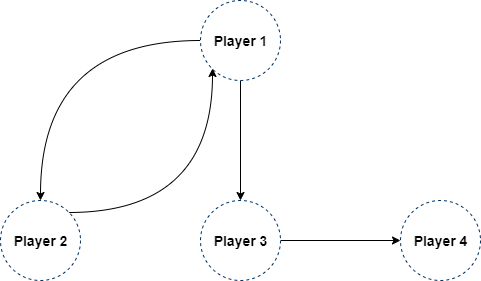

# AWS Game Backend Framework Features: Friends Graph with Amazon Neptune Integration

- [Required preliminary setup](#required-preliminary-setup)
- [Deploying the Friends Graph with Amazon Neptune integration feature](#deploying-the-friends-graph-with-amazon-neptune-integration-feature)
- [Architecture](#architecture)
- [Solution overview](#solution-overview)
- [Testing the Friends Graph feature](#testing-the-friends-graph-feature)
- [Integration with game engines](#integration-with-game-engines)
- [API reference](#api-reference)

This backend feature integration shows how to deploy a backend service that interacts with Amazon Neptune to build a graph of players. Players can add friends and find new friends based on mutual relationships.

# Required preliminary setup

This backend feature **requires** that you have [deployed the Identity component](../../CustomIdentityComponent/README.md). Once that is done, **set** the `const ISSUER_ENDPOINT` in `BackendFeatures/FriendsGraphIntegration/bin/friends_graph_integration.ts` to the value of `IssuerEndpointUrl` found in the stack outputs of the _CustomIdentityComponentStack_. You can find it in the CloudFormation console, or in the terminal after deploying the identity component.

The issuer endpoint is a CloudFormation parameter and the value you set above sets the default value. It's also possible to set the endpoint later on as part of the CDK stack deployment using command line parameters (`--parameters IssuerEndpointUrl=<YOUR-ENDPOINT-HERE>`).

Make sure that you have Docker running before opening any terminals or Powershell as both the backend deployment as well as game server build process will use Docker. You're also expected to have all the tools listed in [Custom Identity Component Readme](../../CustomIdentityComponent/README.md#deploy-the-custom-identity-component) installed.

# Deploying the Friends Graph with Amazon Neptune integration feature

To deploy the component, follow the _Preliminary Setup_, and then run the following commands (Note: on **Windows** make sure to run in Powershell as **Administrator**):

1. Run `npm install` to install CDK app dependencies
2. Run `cdk deploy --all --no-previous-parameters` to deploy both the backend APIs as well as the Amazon Neptune resources CDK apps to your account. You will need to accept the deployment. This will take around 45 minutes to fully deploy.

# Architecture

The architecture diagram below shows the main steps of integration from the game engine to the backend and Amazon Neptune. See the main Readme of the project for details on how the Custom Identity Component is implemented.


# Solution overview

The solution follows the Python Serverless REST API template in `../BackendComponentSamples` and uses Amazon Neptune to store players and friends lists.

Amazon Neptune is a fully managed graph database that allows you to traverse relationships between entities. Each player is stored in the Neptune database as a vertex. When a player adds another player to their friends list, a single-direction edge is created from the player to the friend. The diagram below depicts players and relationships in the graph.



In the sample graph above:

* **Player 1** added **Player 2** and **Player 3** to their friends list. 
* **Player 2** also added **Player 1** to their friends list. 
* **Player 3** added **Player 4** to their friends list.
* **Player 4** does not have anybody on their friends list yet.

## Collaborative filtering

The `get-friends` function can be used to see all users who are friends with a player, who have added the player to their friends list, or recommend new friends.

If the **dir** parameter is set to `out` (default), the function returns all users on the player's friends list (i.e., outbound relationships).

If the **dir** parameter is set to `in`, the function returns all users who have added the player to their friends list (i.e., inbound relationships).

If the **dir** parameter is set to `new`, the function uses collaborative filtering to recommend other users who the player might want to add to their friends list based on the number of mutual connections they share. Collaborative filtering is a a method used to make predictions by filtering for users with similar traits and behaviors.

The diagram below depicts 7 players and their relationships in the graph.


In the sample graph above, when you run the `get-friends` function with the following parameters:
* **player_id:** Player 1
* **dir:** new

The function recommends the following new friends, ordered by the number of edges they share with existing friends:

```
[
    { "Player 5" : 3 },
    { "Player 6" : 2 },
    { "Player 4" : 1 }
]
```

Note that **Player 7** is not returned because they do not share a connection with any of **Player 1**'s existing friends.

## Additional resources

To learn more about collaborative filtering and using Amazon Neptune to build a social network in your games, we recommend the following resources:

* [Getting Started with Amazon Neptune](https://docs.aws.amazon.com/neptune/latest/userguide/graph-get-started.html)
* [Building a Social Network for Games](https://github.com/aws/graph-notebook/blob/main/src/graph_notebook/notebooks/01-Neptune-Database/03-Sample-Applications/07-Games-Industry-Graphs/01-Building-a-Social-Network-for-Games-Gremlin.ipynb)
* [Amazon Neptune Samples - Collaborative Filtering](https://github.com/aws-samples/amazon-neptune-samples/tree/master/gremlin/collaborative-filtering)

# Testing the Friends Graph feature

You can test that the solution is correctly deployed using a Linux or MacOS terminal. To test the solution, set up the login and backend endpoints using the CloudFormation output values of the Custom Identity Component and the Friends Graph Integration stacks.

```
# SET THESE FIRST
login_endpoint=https://YOURENDPOINT/prod
backend_endpoint=https://YOURENDPOINT/prod
```

## Add User 1 to friends graph
Run the following commands to login as a new guest user and add the user to the graph.

```
# LOGIN AS GUEST
login_output=$(curl $login_endpoint/login-as-guest)

# STORE AUTH TOKEN AND USER ID
user_id_1=$(jq -r '.user_id' <<< $login_output)
auth_token_1=$(jq -r '.auth_token' <<< $login_output)

# ADD USER TO FRIENDS GRAPH
curl -H "Authorization: $auth_token_1" $backend_endpoint/set-player
```

You should see an output similar to this from the commands:

```
"v[a0896ee9-5b3c-4243-ac71-b79b1eff8919]"
```

## Add User 2 and User 1 to each other's friends lists
Run the following commands to login as a second new guest user and add the user to the graph.

```
# LOGIN AS GUEST
login_output=$(curl $login_endpoint/login-as-guest)

# STORE AUTH TOKEN AND USER ID
user_id_2=$(jq -r '.user_id' <<< $login_output)
auth_token_2=$(jq -r '.auth_token' <<< $login_output)

# ADD USER TO FRIENDS GRAPH
curl -H "Authorization: $auth_token_2" $backend_endpoint/set-player
```

Run the following commands to add the two users to each others' friends list.

```
# ADD USER 2 TO USER 1'S FRIENDS LIST
curl -H "Authorization: $auth_token_1" "$backend_endpoint/set-friend?friend_id=$user_id_2"

# ADD USER 1 TO USER 2'S FRIENDS LIST
curl -H "Authorization: $auth_token_2" "$backend_endpoint/set-friend?friend_id=$user_id_1"
```

You should see an output similar to this from the commands:

```
["08c900da-6c5f-3caa-7eaa-7a8ab04720bc"]
["ecc900da-6eac-e02e-402c-706a282de657"]
```

Run the following command to see User 1's friends list.

```
curl -H "Authorization: $auth_token_1" $backend_endpoint/get-friends
```

You should see an output similar to this from the command:

```
["v[4e6f5e4e-30bb-4db7-bfd1-ceb35be5f7f6]"]
```

## Create User 3 and add User 2 to their friends list
Run the following commands to login as a third new guest user, add the user to the graph, and add the second user to the third user's friends list.

```
# LOGIN AS GUEST
login_output=$(curl $login_endpoint/login-as-guest)

# STORE AUTH TOKEN AND USER ID
user_id_3=$(jq -r '.user_id' <<< $login_output)
auth_token_3=$(jq -r '.auth_token' <<< $login_output)

# ADD USER TO FRIENDS GRAPH
curl -H "Authorization: $auth_token_3" $backend_endpoint/set-player

# ADD USER 2 TO USER 3'S FRIENDS LIST
curl -H "Authorization: $auth_token_3" "$backend_endpoint/set-friend?friend_id=$user_id_2"
```

Run the following command to list users who have added User 2 to their friends list:

```
curl -H "Authorization: $auth_token_2" "$backend_endpoint/get-friends?dir=in"
```

You should see an output similar to this from the command:

```
[
    "v[a0896ee9-5b3c-4243-ac71-b79b1eff8919]", 
    "v[91b56194-6d9c-437a-ae49-f73a14483635]"
]
```

## Recommend new friends for User 3

Run the following command to find new friends that User 3 might know:

```
curl -H "Authorization: $auth_token_3" "$backend_endpoint/get-friends?dir=new"
```

You should see an output similar to this from the command:

```
[
    {
        "a0896ee9-5b3c-4243-ac71-b79b1eff8919": 2
    }
]
```

# Integration with Game Engines

## Unity integration

To test the integrations with Unity, **open** the Unity sample project (`UnitySample`) with Unity 2021 (or above).

* Then **open** the scene `BackendFeatures/FriendsGraph/FriendsGraph.unity`

This is a test level that has a UI to add and remove friends (based on their vertex ID). At start it will login as a guest user, and then call the `set-player` API to make sure the player is added to the database. You can then add and remove friends, list your added friends, who added you, as well as get suggestions on new friends.

Note that in this sample you need to copy and paste the identifiers across multiple Unity clients, but in your real life implementation you likely have some backend functionality to find friends or add people you've played a game with. Your backend would be the one managing these identifiers and you would map them to things like player names for the client view.

Configure the `FriendsGraphIntegration` component of the `FriendsGraphIntegration` GameObject to set up API endpoints. Set `Login Endpoint Url` value to the `LoginEndpoint` value found in the CustomIdentityComponentStack Outputs, and the `Friends Graph Integration Endpoint Url` to the `BackendEndpointUrl` value found in the *FriendsGraphIntegrationBackend* Outputs.

Press play to test the integration. You'll see the login output, the set-player API output, and can then try the different API:s through the UI.

# API reference

All API requests expect the `Authorization` header is set to the JWT value received when logging in. This is automatically done by the AWS Game SDK's for the different game engines when you call the POST and GET requests through their API's.

### GET /set-player

`GET /set-player`

**Parameters**

None.

**Responses**

> | http code     | response                                                            | description |
> |---------------|---------------------------------------------------------------------|---|
> | `200`         | `{ "v[d41d8cd98f00b204e9800998ecf8427e]" }` | Returns the vertex node of the player created or updated. |
> | `500`         |  `"Unexpected error."` | |

### GET /get-player

`GET /get-player`

**Parameters**

> | name      |  required | description                                                                    |
> |-----------|-----------|--------------------------------------------------------------------------------|
> | `player_id`   |  Yes       | User ID.  |

**Responses**

> | http code     | response                                                            | description |
> |---------------|---------------------------------------------------------------------|---|
> | `200`         | `[ { "v[d41d8cd98f00b204e9800998ecf8427e]" } ]` | List of vertices matching the player ID. |
> | `500`         |  `"Unexpected error."` | |

### GET /set-friend

`GET /set-friend`

**Parameters**

> | name      |  required | description                                                                    |
> |-----------|-----------|--------------------------------------------------------------------------------|
> | `friend_id`   |  Yes       | User ID to add to friends list. |

**Responses**

> | http code     | response                                                            | description |
> |---------------|---------------------------------------------------------------------|---|
> | `200`         | `[ "e[e3b0c44298fc1c149afbf4c8996fb92427ae41e4649b934ca495991b7852b855]" ]` | List of edges connecting from the current player to the friend ID. |
> | `500`         |  `"Unexpected error."` | |

### GET /delete-friend

`GET /delete-friend`

**Parameters**

> | name      |  required | description                                                                    |
> |-----------|-----------|--------------------------------------------------------------------------------|
> | `friend_id`   |  Yes       | User ID to remove from friends list.  |

**Responses**

> | http code     | response                                                            | description |
> |---------------|---------------------------------------------------------------------|---|
> | `200`         | `"Success"` | |
> | `500`         |  `"Unexpected error."` | |

### GET /get-friends

`GET /get-friends`

**Parameters**

> | name      |  required | description                                                                    |
> |-----------|-----------|--------------------------------------------------------------------------------|
> | `player_id`   |  No       | User ID. Default value is current player ID. |
> | `dir` | No | Direction of relationship. Valid values are `in`, `out`, or `new`. Set to `in` to see users who added `player_id` to their friends list. Set to `out` to see users who have been added by `player_id` to their friends list. Set to `new` to find new friend suggestions. Default value is `out`. |
> | `max` | No | Number of user vertices to return. Default value is `10`. |

**Responses**

> | http code     | response                                                            | description |
> |---------------|---------------------------------------------------------------------|---|
> | `200`         | `[ "v[d41d8cd98f00b204e9800998ecf8427e]" ]` or `[ { "v[d41d8cd98f00b204e9800998ecf8427e]" : 3 } ]` | List of user vertices. If `dir` is set to `new`, the number of mutual friends is also returned. |
> | `500`         |  `"Unexpected error."` | |
