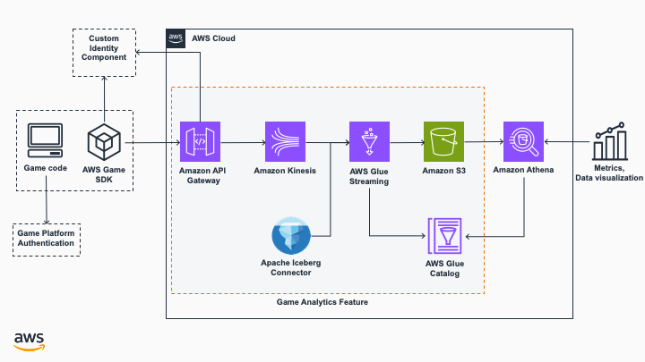

# AWS Game Backend Framework Features: Game Analytics Integration

This backend feature is a ___Proof of Concept (PoC)___, and shows how to implement a modern *shift-left approach* to data quality for game events data on AWS. One that involves moving data quality checks, and assessments earlier in the data lifecycle, i.e. by performing data enrichment extract, transform, and load task (ETL) on ingest. This essentially means that businesses must move data quality responsibilities to the left of the data ingest process, where data quality is addressed as early as possible in the data lifecycle. Along with the Cloud Development Kit (CDK) code for deploying backend services for ingesting game event telemetry data to [Apache Iceberg](https://iceberg.apache.org/) tables, sample ETL scripts that support writing to open-source transactional table formats (or open table formats), this feature comes with a test script, from which you can then extend to using the Unreal, Unity and Godot Game Engines.

## Architecture



## Required preliminary setup

This backend feature **requires** that you have deployed the [Identity component](../../CustomIdentityComponent/README.md)[^1]. Once that is done, **set** the `const ISSUER_ENDPOINT` in `BackendFeatures/GameAnalyticsIntegration/bin/game_analytics_integration.ts` to the value of `IssuerEndpointUrl` found in the stack outputs of the _CustomIdentityComponentStack_. You can find it in the CloudFormation console, or in the terminal after deploying the identity component. Additionally, ensure that you have subscribed to the[Apache Iceberg Connector for AWS Glue](https://aws.amazon.com/marketplace/pp/prodview-iicxofvpqvsio) in the **AWS Marketplace**. 

## Deploying the Game Analytics Integration feature

To deploy the component, follow the _Preliminary Setup_, and then run the following commands:

1. Navigate to `BackendFeatures/GameAnalyticsIntegration/` folder in your terminal or Powershell[^2].
2. Run `npm install` to install CDK app dependencies.
3. Run `cdk deploy --all --require-approval never` to the deploy the backend feature to your AWS account.
4. After the `DeltaLakeIntegrationBackend` has been deployed, capture the value of `AnalyticsIntegrationBackendEndpointUrl` found in the outputs of the _AnalyticsIntegrationBackend_ stack. You can find it in the CloudFormation console, or in the terminal after deploying the identity component.
5. Open the [AWS Glue console](https://console.aws.amazon.com/glue/home) in your AWS account, and use the left-hand navigation panel to select **ETL Jobs**.
6. Click the checkbox for the **GlueStreamEtlJob**, and click the **Run Job** button to run the streaming ETL operations.

## Testing the Game Analytics Integration feature

A sample Python script to generate synthetic game telemetry events has been provided in the `tests` folder. Run the following steps to test the integration:

1. Navigate to `BackendFeatures/DeltaLakeIntegration/tests` folder in your terminal or Powershell[^2].
2. Install the necessary Python packages, by running `python -m pip install -r requirements.txt`.
3. Run the following command to generate 100 synthetic game events[^3]:
    ```bash
    python synthetic_events.py --login-endpoint <`LoginEndpoint` value from the output of the `CustomIdentityComponentStack` stack> --backend-endpoint <`AnalyticsIntegrationBackendEndpointUrl` value from the `AnalyticsIntegrationBackend` stack> --max-count 100 --console
    ```
4. After the script has completed running, open the [Amazon S3 console](https://console.aws.amazon.com/s3), and navigate to the Bucket that starts with the `analyticsintegrationbacken-...`. You should see the raw data folder, similar to the following:
    ```bash
    .
    ├── analytics_events_db
    │   └── game-events
    │       ├── analytics_events_db.db
    │       │   └── events_table
    │       │       ├── data
    │       │       │   ├── event_type=End+Game
    │       │       │   │   ├── 00000-12-15789a19-93d4-4419-a792-fd6efcc8994d-00003.parquet
    │       │       │   │   ├── 00000-4-91935010-e690-4cd5-ac2c-38bd95385354-00002.parquet
    │       │       │   │   ├── ...
    │       │       │   ├── event_type=Login
    │       │       │   │   ├── 00000-12-15789a19-93d4-4419-a792-fd6efcc8994d-00001.parquet
    │       │       │   │   ├── 00000-8-521002c6-a26d-4e32-880b-a97c3c1e8b4c-00005.parquet
    │       │       │   │   ├── ...
    │       │       │   ├── event_type=Logout
    │       │       │   │   ├── 00000-12-15789a19-93d4-4419-a792-fd6efcc8994d-00004.parquet
    │       │       │   │   ├── 00000-4-91935010-e690-4cd5-ac2c-38bd95385354-00003.parquet
    │       │       │   │   ├── ...
    │       │       │   ├── event_type=New+Game
    │       │       │   │   ├── 00000-12-15789a19-93d4-4419-a792-fd6efcc8994d-00002.parquet
    │       │       │   │   ├── 00000-4-91935010-e690-4cd5-ac2c-38bd95385354-00001.parquet
    │       │       │   │   ├── ...
    │       │       │   └── event_type=Resume+Game
    │       │       │       ├── 00000-12-15789a19-93d4-4419-a792-fd6efcc8994d-00005.parquet
    │       │       │       ├── 00000-4-91935010-e690-4cd5-ac2c-38bd95385354-00004.parquet
    │       │       │       ├── ...
    │       │       └── metadata
    │       │           ├── 00000-94889c79-9f06-467d-98d3-24d8bb742cdc.metadata.json
    │       │           ├── 00001-2fa45335-69b6-4f97-8d23-3cb6bb95296d.metadata.json
    │       │           ├── ...
    │       ├── spark_history_logs
    │       │   ├── appstatus_spark-application-1726237233690.inprogress
    │       │   ├── appstatus_spark-application-1726238287385.inprogress
    │       │   ├── ...
    │       ├── temp
    │       │   ├── ...
    │       └── ...
    └── ...
    ```
5. Following the Solution [README](../../README.md) to integrate the feature into your game engine.

## API reference

All API requests expect the `Authorization` header is set to the JWT value received when logging in. This is automatically done by the AWS Game SDK's for the different game engines when you call the POST and GET requests through their API's.

### POST /put-record

`POST /put-record`

**Parameters**

> | name      |  required | description                                                                    |
> |-----------|-----------|--------------------------------------------------------------------------------|
> | `body`   |  Yes       | The body of the POST request. Must be in JSON format with latencies to the different Regions. Example: `{"event_id": "00006", "event_type": "Login", "updated_at": "2024-02-22 03:03:02", "event_data": "The only thing we have to fear is fear itself."}`  |

**Responses**

> | http code     | response                                                            |
> |---------------|---------------------------------------------------------------------|
> | `200`         | `"Successfully added event"`                                |
> | `401`         | `"Unauthorized"`                                  |
> | `500`         |  `"Failed"`                            |

---

**Notes:**

[^1]: You're also expected to have all the tools listed in [Custom Identity Component Readme](../../CustomIdentityComponent/README.md#deploy-the-custom-identity-component) installed.
[^2]: On **Windows** make sure to run in Powershell as **Administrator**.
[^3]: Run the command with just the `--dry-run` parameter first to verify script functionality.
