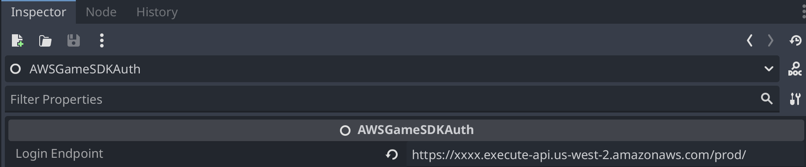

# AWS Game Backend Framework Godot 4 SDK

The AWS Game Backend Framework Godot 4 SDK provides integrations to the custom identity component, managed refreshing of access tokens, helper methods for calling custom backend features, and samples for integrating with different game platforms.

# SDK Overview - Now a Godot Plugin

The AWS Game SDK has been updated to now be installed and used as a plugin in Godot 4.x.

To begin using the plugin, copy the ./addons/AWSGameSDK directory to your projects ./addons directory. It should appear as it does in the picture below.


Next, go to Project -> Project Settings... from your menu and enable the AWS Games SDK plugin by checking the checkbox.


## Adding nodes for the AWS for Games SDK to your scenes

The AWS Game SDK contains two components that can be added to your projects. These are `AWSGameSDKAuth` and `AWSGameSDKBackend`. The AWSGameSDKAuth component allows you to login as guest, refresh your access token, and link accounts to Facebook, Apple, Google Play, and Steam via an API endpoint. The AWSGameSDKBackend component allows you to make calls to a backend endpoint to save and retrieve player data. You can add the necessary nodes to an appropriate scene for your project. The AWSGameSDKBackend requires the AWSGameSDKAuth component, as access tokens are required to save and retrrieve data. These components can be added by adding child nodes to your scene. 


Once added, your scene tree should look similar to this.


The plugin also uses signals. This removes the need to register callbacks and you can setup appropriate listeners to features enabled via the plugin.

## Initializing the SDK and Login

Initialization of the SDKs has been moved to property sheets to make it easier for developers to make calls.

To complete setup of the AWSGameSDKAuth component, highlight the component in your scene tree and view the properties in the Inspector window. Update the `Login Endpoint` value with your API Gateway Login Endpoint, as shown below.



To complete setup of the AWSGameSDKBackend component, highlight the component in your scene tree and view the properties in the Inspector window. Update the `Backend Endpoint` value with your API Gateway Backend Endpoint, as shown below. You can leave the URIs as default.


In your scene's code, you will need to set a variable for each of the SDK components you enable

```python
@onready var aws_games_sdk_auth = get_node("AWSGameSDKAuth")
@onready var aws_games_sdk_backend = get_node("AWSGameSDKBackend")
```

Within the `_ready` function, connect your local functions to the signals from the SDK:
	
```python
func _ready():
	# Get the SDK and Init
	aws_games_sdk_auth.init()																	#initialize the Auth SDK
	aws_games_sdk_auth.aws_login_success.connect(_on_login_success)								#handle successful logins
	aws_games_sdk_auth.aws_login_error.connect(_on_login_error)									#handle login errors
	aws_games_sdk_auth.aws_sdk_error.connect(_on_aws_sdk_error)									#handle general SDK errors
	aws_games_sdk_backend.aws_backend_request_successful.connect(_on_backend_request_success)	#handle successful backend requests
	aws_games_sdk_backend.aws_sdk_error.connect(_on_aws_sdk_error)								#handle errors from backend requests
```

To begin the login process, call login on the AWSGameSDKAuth component, as such:
	
```python
	aws_games_sdk_auth.login()	
```

Errors for login can be managed with similar functions to those below:
	
```
func _on_login_error(message):
	print("Login error: " + message)


# Receives a UserInfo object after successful login
func _on_login_success():
	print("Received login success")
```

## Set and Get Data from your custom backend

Setting and getting data to and from your backend uses the AWSGameSDKBackend with the `backend_set_request` and `backend_get_request` functions. Both of these functions use HTTP GET requests. To set data, use the following syntax:
	
```python
	aws_games_sdk_backend.backend_set_request(aws_games_sdk_auth.get_auth_token(), {"player_name" : "John Doe"})
```	

In this case, the auth_token to make the call is retrieved from the aws_games_sdk_auth component and the `player_name` is set to `John Doe`. Multiple values can be set in a single dictionary request.

To retrieve data, use the following syntax:
	
```python
	aws_games_sdk_backend.backend_get_request(aws_games_sdk_auth.get_auth_token())
```

This call only requires the auth_token from the aws_games_sdk_auth component.

Success and errors of both calls are handled through signal connections that were added to the `_ready` function above. A sample success function is as follows:
	
```python
func _on_backend_request_success():
	print("Backend request successful")
	print("Data returned from action: ", aws_games_sdk_backend.get_response_data())
```

## SDK Public API

The public API for the AWSGameSDKAuth component includes the following methods. Most of them will require you to provide a callback for results (see the Godot 4 Integration Samples for sample code):

```text
func init()
func login()
func login_with_refresh_token()
func get_auth_token() String
func link_steam_id_to_current_user(steam_token)
func login_with_steam_token(steam_token)
func link_apple_id_to_current_user(apple_auth_token)
func login_with_apple_id_token(apple_auth_token)
func link_google_play_id_to_current_user(google_play_auth_token)
func login_with_google_play_token(google_play_auth_token)
func link_facebook_id_to_current_user(facebook_access_token, facebook_user_id)
func login_with_facebook_access_token(facebook_access_token, facebook_user_id)
```

Supported signals are:

```text
aws_login_success
aws_login_error
aws_sdk_error
steam_link
steam_login
fb_link
fb_login
apple_link
apple_login
goog_link
goog_login
````

The public API for the AWSGameSDKBackend component includes the following methods.

```python
func backend_get_request(auth_token)
func backend_set_request(auth_token, query_parameters)
func backend_post_request(auth_token, request_body)
func get_response_data() String
```

Supported signals are:

```text
aws_backend_request_successful
aws_sdk_error
```

# Godot 4 Integration Samples

To test the integrations with Godot 4, open the Godot 4 sample project (`GodotSample`) with Godot 4.

## Guest Identity and Rest API test scene

* Open the scene `Samples/GuestIdentityAndRestApiBackend/GuestIdentityAndRestApiBackend.tscn`

This is a simple test scene that will login as a new guest user if a save file is not present, or login using the user_id and guest_secret found in the save file if available to login as an existing user. It will then use the logged in user to set player name and get player name in sequence to test the HTTP API integration

Configure the `Samples/GuestIdentityAndRestApiBackend/GuestIdentityAndRestApiBackend.gd` script to set up API endpoints. Set `const login_endpoint` value to the `LoginEndpoint` value found in the CustomIdentityComponentStack Outputs, and the `const backend_endpoint` to the `BackendEndpointUrl` value found in the PythonServerlessHttpApiStack Outputs or the `FargateSampleNodeJsServiceServiceURL` found in the NodeJsFargateApiStack Outputs. Both backend sample integrations support the same functionality to validate tokens and set and get player data.

Press "Run current scene" to test the integration. You'll see the login and backend call activity in the Output console.

## Steam test scene

* Open the scene `Samples/SteamIdLogin/SteamIdLogin.tscn`

This is a simple test scene that will login a guest user, upgrade the guest user to authenticated by linking a Steam ID to it, and then finally test logging in directly with Steam. It doesn't call any custom backend functionalities.

To use this sample, you will need a valid Steam ID token. This requires you to sign up as a Steam Developer, create an App and the [Godot Steam SDK](https://godotsteam.com/) to integrate with Steam. You'll then use either _GetAuthTicketForWebApi_ (new) or _GetAuthSessionTicket_ (old) to retrieve a ticket to validate with the identity component API.

Configure the `Samples/SteamIdLogin/SteamLogin.gd` script to set up the login API endpoint. Set `const login_endpoint` value to the `LoginEndpoint` value found in the CustomIdentityComponentStack Outputs.

You will need to pass a valid Steam token to the `self.aws_game_sdk.link_steam_id_to_current_user("YourTokenHere", self.on_link_steam_id_response)` and `self.aws_game_sdk.login_with_steam_token("YourTokenHere", self.on_login_with_steam_response)` found in `Samples/SteamIdLogin/SteamLogin.gd`.

## Facebook test scene

* Open the scene `Samples/FacebookLogin/FacebookLogin.tscn`

This is a simple test scene that will login a guest user, upgrade the guest user to authenticated by linking a Facebook ID to it, and then finally test logging in directly with Facebook. It doesn't call any custom backend functionalities.

To use this sample, you will need a valid Facebook access token and Facebook User ID. This requires you to sign up as a Facebook Developer, create an App and using one of the community integrations with Facebook to login (such as [this](https://github.com/DrMoriarty/godot-facebook)). After calling _Login_ with Facebook you'll receive and access token and user ID which need to be passed to the SDK integrations.

Configure the `Samples/FacebookLogin/FacebookLogin.gd` script to set up the login API endpoint. Set `const login_endpoint` value to the `LoginEndpoint` value found in the CustomIdentityComponentStack Outputs.

You will need to pass a valid Facebook access token and User ID to the `self.aws_game_sdk.link_facebook_id_to_current_user("AcceessTokenHere", "UserIdHere", self.on_link_facebook_id_response)` and `self.aws_game_sdk.login_with_facebook_access_token("AccessTokenHere", "UserIdHere", self.on_login_with_facebook_response)` found in `Samples/FacebookLign/FacebookLogin.gd`.

## Google Play and Sign in with Apple testing

The sample project does not come with Google Play or Sign in with Apple sample scenes and scripts. Currently, Godot 4 integrations with Apple ID or Google Play are not easily available. If you build such integration yourself, you can use the APIs provided in the SDK to log in with Google Play and Apple ID, as these functionalities are fully supported by the SDK.

The following SDK functions can be used for this in a very similar fashion as with the Steam and Facebook integrations:

```text
func link_apple_id_to_current_user(apple_auth_token, login_callback_apple)
func login_with_apple_id_token(apple_auth_token, login_callback)
func link_google_play_id_to_current_user(google_play_auth_token, login_callback_google)
func login_with_google_play_token(google_play_auth_token, login_callback)
```
