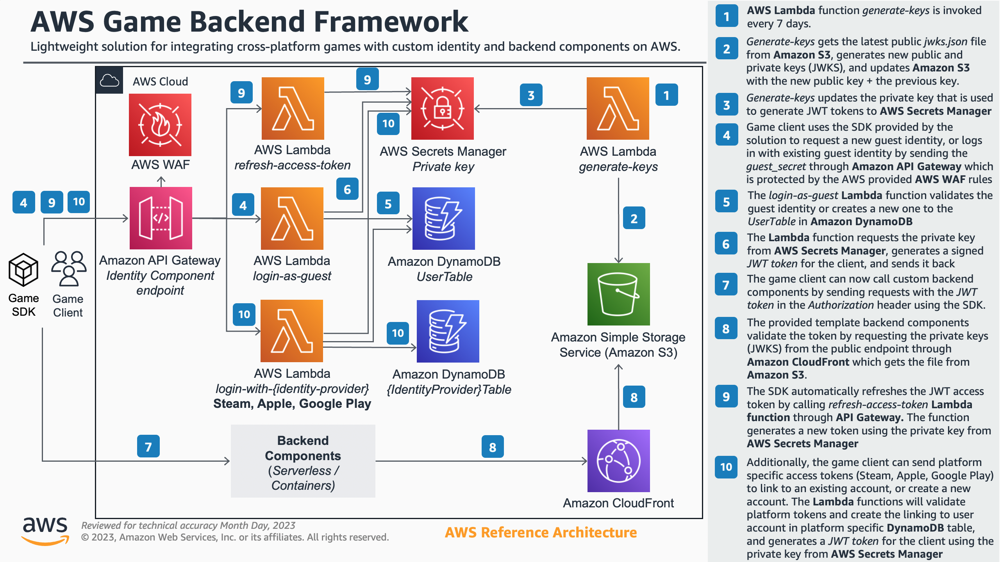

# AWS Game Backend Framework

- [Introduction](#introduction)
  * [Solution components](#solution-components)
  * [How does it work?](#how-does-it-work)
- [Deploying the solution](#deploying-the-solution)
  * [1. Deploy the Custom Identity Component](#1-deploy-the-custom-identity-component)
  * [2. Deploy one of the sample backend components](#2-deploy-one-of-the-sample-backend-components)
  * [3. Test the client integrations](#3-test-the-client-integrations)
    + [Unreal Engine 5 SDK and Integration Samples](#unreal-engine-5-sdk-and-integration-samples)
    + [Unity SDK and Integration Samples](#unity-sdk-and-integration-samples)
    + [Godot 4 SDK and Integration Samples](#godot-4-sdk-and-integration-samples)
- [Governance](#governance)
- [Cost estimations and scalability considerations](#cost-estimations-and-scalability-considerations)
  * [Scalability considerations](#scalability-considerations)
- [Security](#security)
- [License](#license)

# Introduction

The AWS Game Backend Framework allows you to integrate your game clients with AWS backend services, with secure scalable identity management and authentication, and integrations to commonly used game platform identity providers and game engines.

The framework consists of four key components:
* Custom identity component, that can be deployed with AWS Cloud Development Kit. Supports __guest identities__, __Steam__, __Sign in with Apple__, __Google Play__, and __Facebook__.
* Lightweight game engine SDK:s for __Unreal Engine 5__,  __Unity 2021 (and up)__, and __Godot 4__
* Sample backend component templates to get started with backend feature development
* Backend Features for specific use cases (such as **Amazon GameLift integration**)

The currently supported engines include Unity, Unreal Engine 5, and Godot 4, but as the features are exposed as REST API:s, you can easily integrate the identity component and custom backend components to any game engine of choice.

The currently supported login options for the identity component include __guest identities__, __Steam__, __Sign in with Apple__, __Google Play__, and __Facebook__. Using these integrations as a template, it's possible to add other platforms such as console identity systems and other PC game stores.

**NEW!** If you're looking for quick and easy step by step guide to get started, check out the [**Workshop for AWS Game Backend Framework**](https://catalog.us-east-1.prod.workshops.aws/workshops/086bb355-4fdc-4e63-8ca7-af7cfc45d4f2/en-US).

**Note**: _“The sample code; software libraries; command line tools; proofs of concept; templates; or other related technology (including any of the foregoing that are provided by our personnel) is provided to you as AWS Content under the AWS Customer Agreement, or the relevant written agreement between you and AWS (whichever applies). You should not use this AWS Content in your production accounts, or on production or other critical data. You are responsible for testing, securing, and optimizing the AWS Content, such as sample code, as appropriate for production grade use based on your specific quality control practices and standards. Deploying AWS Content may incur AWS charges for creating or using AWS chargeable resources, such as running Amazon EC2 instances or using Amazon S3 storage.”_

## Solution components

* **Custom Identity Component** (`CustomIdentityComponent` folder contains [Readme](CustomIdentityComponent/README.md)):
  * Deployed before any other components
  * Implemented with AWS Cloud Development Kit (CDK)
  * Manages the player identities and authentication tokens
  * Supports refreshing authentications tokens
  * Supports integrating with 3rd party identity providers such as Steam, Sign in with Apple, Google Play, and Facebook
  * See the [API Reference](CustomIdentityComponent/README.md#api-reference) for full API details.
* **Backend Component Templates** (`BackendComponentSamples` folder contains [Readme](BackendComponentSamples/README.md))
  * Template backend components that integrate with the custom identity component and the Unreal, Unity and Godot SDK:s
  * Implemented with AWS Cloud Development Kit (CDK)
  * Demonstrate how to get started with serverless and containerized backend development, with authenticated user access
  * Implement best practices such as resource tagging, observability (with distributed tracing), and security guidelines (cdk-nag)
* **Backend Features**
  * Full backend feature implementations for different use cases (currently Amazon GameLift integration)
  * See the [Amazon GameLift Integration Readme](BackendFeatures/AmazonGameLiftIntegration/README.md) for details
* **Unreal Engine 5 Samples with AWS Game SDK** (`UnrealSample` folder contains [Readme](UnrealSample/README.md))
  * Unreal Engine 5 version of the AWS Game SDK and sample levels for integration with different identity providers
  * For SDK details see the [Unreal SDK Overview](UnrealSample/README.md#sdk-overview)
* **Unity Samples with AWS Game SDK** (`UnitySample` folder contains [Readme](UnitySample/README.md))
  * Unity 2021 (and up) version of the AWS Game SDK and sample scenes for integration with different identity providers
  * For SDK details see the [Unity SDK Overview](UnitySample/README.md#sdk-overview)
* **Godot 4 Samples with AWS Game SDK** (`GodotSample` folder contains [Readme](GodotSample/README.md))
  * Godot 4 version of the AWS Game SDK and sample scenes for integration with different identity providers
  * For SDK details see the [Godot 4 SDK Overview](GodotSample/README.md#sdk-overview)

**High Level Architecture**



## How does it work?

Once you have the identity component deployed, you can create a new guest user account with (Unity code as a sample):

```csharp
AWSGameSDKClient.Instance.LoginAsNewGuestUser(this.OnLoginResponse);
```

After this you can deploy some of the sample backend templates and call them securely with (Unity code as a sample):

```csharp
AWSGameSDKClient.Instance.BackendGetRequest(this.backendEndpointUrl, "get-player-data", this.OnGetPlayerDataResponse);
```

Then in the backend code you'll have an authenticated user ID that you can use to access their data. The solution comes with two sample backend components, a serverless API Gateway HTTP API (Python) and a AWS Fargate service (Node.js) to demonstrate the player access authorization and simple backend functionality to store and retrieve player data.

# Deploying the solution

Start by cloning the repository. On **Windows** make sure to have a **short path** to the repository (like `C:\Projects\aws-game-backend-framework` containing the source directly) to avoid any path length issues:

```bash
git clone https://github.com/aws-solutions-library-samples/guidance-for-custom-game-backend-hosting-on-aws.git
```

## 1. Deploy the Custom Identity Component

See the [Readme for the Custom Identity Component](CustomIdentityComponent/README.md#deploy-the-custom-identity-component) and follow the instructions to deploy the custom identity component.

## 2. Deploy one of the sample backend components

See the [Readme for Sample Backend Components](BackendComponentSamples/README.md#serverless-rest-api-sample-component-template) to deploy either the **Serverless REST API sample component** or the **Loadbalanced AWS Fargate sample component** that you will use with the Unreal, Unity, and Godot sample integrations to test using an identity from the custom identity component to make authenticated calls to a simple backend to set and get player data.

## 3. Test the client integrations

To test the client integrations, you can use the Unreal, Unity, or Godot sample projects (`UnrealSample`, `UnitySample` and `GodotSample`), that include a lightweight SDK called `AWSGameSDK` to interact with the identity component and your backend features.

### Unreal Engine 5 SDK and Integration Samples

See the [Unreal SDK Readme](UnrealSample/README.md#unreal-integration-samples) for details on the Unreal 5 integration SDK and samples

### Unity SDK and Integration Samples

See the [Unity SDK Readme](UnitySample/README.md#unity-integration-samples) for details on the Unity integration SDK and samples

### Godot 4 SDK and Integration Samples

See the [Godot 4 SDK Readme](GodotSample/README.md#unity-integration-samples) for details on the Godot 4 integration SDK and samples

# Governance

All the resources of the solution are deployed as AWS Cloud Development Kit (CDK) stacks. This allows for a consistent and repeatable deployment across multiple environments (dev, test, prod). It's recommended that you'll separate these environments to different AWS accounts under the same AWS Organization, and provide least privilege access based on the environment.

All the CDK stacks implement **tags** that can also be configured to be used for [cost allocation](https://docs.aws.amazon.com/awsaccountbilling/latest/aboutv2/custom-tags.html). You can freely modify the specific tags that are applied to all resources by modifying the CDK templates. 

An example of the default tagging scheme for the stack resources:

```typescript
let tags: { [key: string]: string } = {};
tags['Application'] = 'CustomIdentityComponent';
tags['Owner'] = 'MyTeam';
tags['Environment'] = 'Dev';
tags['CostCenter'] = '1000';
```
# Cost estimations and scalability considerations

As the backend component costs depend extensively on customer specific implementations, and the samples are just templates to get started, they have been left out of the cost estimations.

**Custom Identity Component Costs**

The Custom Identity Component costs can be estimated more easily, and the following breakdown aims to be a pessimistic estimate for 10 000 concurrent users, which can often be mapped roughly to 100k daily users and 1M monthly users.

**NOTE**: These are rough estimates only, and even though they are calculated with a very pessimistic approach, there can always be some costs that are not fully covered here. You always need to do your own testing and estimates.

**Concurrent users**: _10 000_ (roughly 100k daily and 1M monthly users)

**Region**: _Us-East-1_
 
* **API Gateway requests** 667 per minute (clients need to log in or refresh access tokens every 15 minutes)
  * *116.85 USD / month*
* **AWS Web Application Firewall**: 667 requests per minute, 2 rules (managed rule set and rate limited)
  * *33.40 USD / month*
* **AWS Lambda requests** 667 per minute (200ms estimated length, 2048MB memory)
  * *193.74 USD / month*
* **DynamoDB requests**: 10k writes and reads per hour (pessimistic estimation based on both re-logins and new users coming in at 5k per hour)
  * *10.29 USD / month*
* **AWS CloudWatch Logs**: 10 GB data estimated ingested per month
  * *5.55 USD / month*
* **AWS Secrets Manager**: 10000 request per hour (very pessimistically estimated for 200 concurrent Lambda invocations)
  * *4.05 USD / month*
* **AWS X-Ray**: 667 traces per minute, 5% default sampling rate
  * *7.20 USD / month*

**TOTAL**: *371.09 USD / month* (_$0.037/CCU_, roughly _$0.00037/MAU_)

## Scalability considerations

As all components of the identity solution are serverless, and Amazon DynamoDB is configured in on-demand mode allowing scaling based on demand, the solution scales automatically within your accounts soft limits. Though these default limits are sufficient for even relatively large amounts of requests, you should always check all the service quotas for the individual services and API:s from AWS documentation, and make sure you are ready to scale for production by requesting limit increases through AWS Support.

The custom identity component has been tested with 2783 requests/second combining new user creation and existing user login. This test didn't surface any errors outside of very few occasional Lambda execution failures. This transaction amount per second can support around 2.5 million concurrent users (CCU), as users log in or refresh acccess tokens every 15 minutes. P90 reponse time was 160ms. In addition, the containerized Fargate Node.js backend component was tested at 5566 request/per second (get and set player data on each login), and it provided a p90 of 48ms when pre-scaled to 25 Tasks. There's no reason to expect this is the upper limit of the solution, but you always need to validate and load test for your own use case. The default account Lambda concurrency limit of 400 was reached at this scale, but you can request an increase to that limit.

For logging in with 3rd party identity providers like Steam, Apple, Google Play or Facebook, the backend will make requests to their endpoints to validate tokens. These endpoints might have their own limits that you need to validate with the 3rd parties directly. As the solution supports up to 7 days of refreshing an existing access token by default (using the refresh token), this can massively reduce the amount of times you need to log in directly with the game platform identities and reduces the load from these endpoints. You can freely control this limit and allow even longer living refresh tokens, as long as you also extend the keys rotation schedule.

## Security

See [CONTRIBUTING](CONTRIBUTING.md#security-issue-notifications) for more information.

## License

This library is licensed under the MIT-0 License. See the LICENSE file.